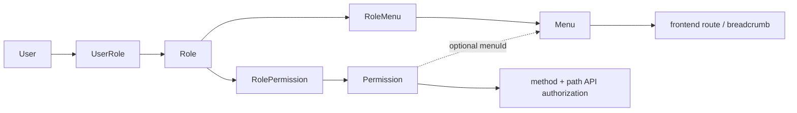

# API 設計書（manpower-blog-backend）

## 1. 前提

本書は `manpower-blog-backend` の現在の Controller、DTO、権限設計を基準にした API 設計書である。

API は利用者ごとに3つの接入面へ分かれる。

| 接入面 | Base path | Module | 利用者 |
|---|---|---|---|
| 運用者面 | `/api/system/**` | `blog-admin-api` | 管理画面の運用者 |
| ポータル面 | `/api/portal/**` | `blog-portal-api` | 匿名の閲覧者 |
| 会員面 | `/api/member/**` | `blog-member-api` | ログインした会員 |

バックエンド API は共通して `Result<T>` を返す。

```json
{
  "code": 200,
  "message": "success",
  "data": {},
  "traceId": "...",
  "timestamp": "..."
}
```

## 2. 運用者認証

会員の認証は 6 章を参照。運用者と会員は署名鍵・issuer が異なり、互いのトークンは通用しない。

### 2.1 Login

| Method | Path | 説明 | 認証 |
|---|---|---|---|
| POST | `/api/system/auth/login` | ログインして JWT を発行する | 不要 |

Request:

```json
{
  "accountType": "EMAIL",
  "accountValue": "admin@example.com",
  "password": "password"
}
```

`accountType` は `EMAIL` / `PHONE`。

Response（`data` 部）:

```json
{
  "accessToken": "jwt-token",
  "user": {
    "userId": 1,
    "accountId": 1,
    "nickName": "admin",
    "accountType": "EMAIL",
    "accountValue": "admin@example.com",
    "roleNames": ["管理者"]
  }
}
```

トークンは `Authorization` レスポンスヘッダーにも `Bearer <token>` 形式で設定される。

### 2.2 Logout / Me

| Method | Path | 説明 | 認証 |
|---|---|---|---|
| POST | `/api/system/auth/logout` | ログアウト | 必要 |
| GET | `/api/system/auth/me` | ログインユーザー、メニュー、権限コードを取得 | 必要 |

`/me` response（`data` 部）:

```json
{
  "user": {
    "userId": 1,
    "accountId": 1,
    "nickName": "admin",
    "accountType": "EMAIL",
    "accountValue": "admin@example.com",
    "roleNames": ["管理者"]
  },
  "menus": [
    {
      "id": 1,
      "parentId": 0,
      "name": "System",
      "path": "/system",
      "component": "SystemLayout",
      "type": 1,
      "children": []
    }
  ],
  "permissions": ["system:menu:list", "system:permission:create"]
}
```

## 3. API 認可

### 3.1 接入面ごとの認可

認可方式は接入面ごとに異なる。面は `SecurityFilterChain` の `securityMatcher` で分割している（設計理由は ARCHITECTURE.md 11.13）。

| 接入面 | 認証 | 認可 | 認証不要のもの |
|---|---|---|---|
| 運用者面 `/api/system/**` | 運用者用 JWT | 動的認可（3.2） | `POST /api/system/auth/login` |
| ポータル面 `/api/portal/**` | なし | GET のみ許可、他は拒否 | GET 全て |
| 会員面 `/api/member/**` | 会員用 JWT | 認証済みであること（権限体系を持たない） | `POST /api/member/auth/login`、`POST /api/member/auth/register` |
| 既定（上記以外） | なし | 右記以外は拒否 | `/error/**`、`/favicon.ico`、`/swagger-ui/**`、`/v3/api-docs/**`、`/actuator/health` |

いずれの面でも `OPTIONS` は許可する。

### 3.2 運用者面の動的認可

運用者面の API 認可は `DynamicAuthorizationManager` が担当する。Controller の `@PreAuthorize` は使用しない。

判定データ:

| Field | 説明 |
|---|---|
| `method` | HTTP method |
| `path` | API path |
| `code` | 権限コード |

判定フロー:

1. JWT filter が token を検証する。
2. `DynamicAuthorizationManager` が request method/path を取得する。
3. `PermissionRuleProvider.loadEnabledRules()` で有効な API 権限ルールを取得する。
4. request の `method + path` に一致するルールの `code` を特定する。
5. JWT filter が設定したユーザー Authority に `code` がなければ 403 を返す。
6. 一致するルール自体が存在しない場合も 403 を返す（既定拒否）。

以下はログイン済みであれば権限コードなしで利用できる（`DynamicAuthorizationManager` 内で固定）。

- `/api/system/auth/me`
- `/api/system/auth/logout`
- `/api/system/menu/my-tree`

## 4. System API

一覧取得はページングありを `/page`、ページングなしを `/list` とする。
Java のメソッド名は Controller・Application Service・Repository を通して
`page` / `list` / `listEnabled` / `findById` / `create` / `update` / `delete` / `changeStatus` で統一する。

### 権限コードの命名規約

形式は `<ドメイン>:<リソース>:<動詞>[修飾語]` とし、`PermissionCode`（system ドメインの値オブジェクト）が権限の生成時に強制する。

| 段 | 規則 | 例 |
|---|---|---|
| ドメイン | `system` / `content` / `member` のいずれか。API パス（接入面）ではなくドメイン名 | `content:article:list` は `/api/system/article/page` に対応 |
| リソース | lowerCamelCase | `user`、`article` |
| 動詞 | `list` / `create` / `update` / `delete` / `changeStatus` / `detail` | |
| 修飾語 | 任意。大文字で始まり、基本動詞から派生した操作を表す | `listEnabled`、`updateAuthorization` |

`t_sys_permission.code` は一意であり、権限コードと API は 1 対 1 で対応する。
同じリソースの派生した参照・更新は、動詞を新設せず基本動詞に修飾語を付けて区別する。
修飾語は Java のメソッド名（`listEnabled` 等）と語彙を揃える。

### 4.1 User API

Base path: `/api/system/user`

| Method | Path | 権限 code 例 | 説明 |
|---|---|---|---|
| GET | `/page` | `system:user:list` | ユーザー一覧をページング取得 |
| GET | `/{id}` | `system:user:detail` | ユーザー詳細取得 |
| POST | （Base path） | `system:user:create` | ユーザー作成 |
| PUT | `/{id}` | `system:user:update` | ユーザー更新 |
| DELETE | `/{id}` | `system:user:delete` | ユーザー削除 |
| PATCH | `/{id}/status` | `system:user:changeStatus` | ユーザー状態変更 |

### 4.2 Role API

Base path: `/api/system/role`

| Method | Path | 権限 code 例 | 説明 |
|---|---|---|---|
| GET | `/list` | `system:role:list` | ロール一覧取得 |
| GET | `/{id}` | `system:role:detail` | ロール詳細取得 |
| POST | （Base path） | `system:role:create` | ロール作成 |
| PUT | `/{id}` | `system:role:update` | ロール更新 |
| DELETE | `/{id}` | `system:role:delete` | ロール削除 |
| PATCH | `/{id}/status` | `system:role:changeStatus` | ロール状態変更 |
| GET | `/{id}/authorization` | `system:role:detailAuthorization` | メニュー、権限、選択済み ID を一括取得 |
| PUT | `/{id}/authorization` | `system:role:updateAuthorization` | メニューと権限を同一トランザクションで保存 |

### 4.3 Permission API

Base path: `/api/system/permission`

| Method | Path | 権限 code 例 | 説明 |
|---|---|---|---|
| GET | `/page` | `system:permission:list` | API 権限のページ一覧取得（keyword / menuId / method / status） |
| POST | （Base path） | `system:permission:create` | 権限作成 |
| GET | `/{id}` | `system:permission:detail` | 権限詳細取得 |
| PUT | `/{id}` | `system:permission:update` | 権限更新 |
| DELETE | `/{id}` | `system:permission:delete` | 権限削除 |

Permission request の主な項目:

| Field | 説明 |
|---|---|
| `menuId` | 所属メニュー ID。未所属の共通権限は `null` |
| `name` | 権限名 |
| `code` | 権限コード |
| `path` | API path（必須） |
| `method` | HTTP method（必須） |
| `status` | 状態 |

### 4.4 Menu API

Base path: `/api/system/menu`

| Method | Path | 権限 code 例 | 説明 |
|---|---|---|---|
| GET | `/tree` | `system:menu:list` | 管理用全メニューツリー取得 |
| GET | `/my-tree` | （ログインのみ） | ログインユーザー用メニューツリー取得 |
| GET | `/tree/enabled` | `system:menu:listEnabled` | 有効メニューツリー取得 |
| GET | `/options` | `system:menu:listOptions` | 親メニュー候補取得 |
| GET | `/{id}` | `system:menu:detail` | メニュー詳細取得 |
| POST | （Base path） | `system:menu:create` | メニュー作成 |
| PUT | `/{id}` | `system:menu:update` | メニュー更新 |
| DELETE | `/{id}` | `system:menu:delete` | メニュー削除 |
| PATCH | `/{id}/status` | `system:menu:changeStatus` | メニュー状態変更 |

Menu request の主な項目:

| Field | 説明 |
|---|---|
| `parentId` | 親メニュー ID |
| `name` | メニュー名 |
| `path` | frontend route path。例: `/system/menu` |
| `component` | frontend component key。例: `system/menu/index` |
| `type` | ディレクトリ / メニュー |
| `sort` | 表示順 |
| `icon` | icon key |
| `status` | 状態 |

Permission の `menuId` は管理画面での分類・検索に利用する任意項目である。
API 認可そのものは role-permission の割当で判定する。

Permission は親子関係や MENU/BUTTON/API の種別を持たない。全レコードが実行可能な API 権限ルールである。

### 4.5 Article Management API

Base path: `/api/system/article`

| Method | Path | 権限 code 例 | 説明 |
|---|---|---|---|
| GET | `/page` | `content:article:list` | 下書き・公開・非公開を含む記事ページ一覧取得 |
| GET | `/{id}` | `content:article:detail` | 管理用記事詳細取得 |
| POST | （Base path） | `content:article:create` | 記事作成。作成者 ID はログイン情報から設定 |
| PUT | `/{id}` | `content:article:update` | 記事更新 |
| DELETE | `/{id}` | `content:article:delete` | 記事論理削除 |
| PATCH | `/{id}/status` | `content:article:changeStatus` | 下書き・公開・非公開の状態変更 |

## 5. Portal API

### 5.1 Ping

| Method | Path | 説明 |
|---|---|---|
| GET | `/api/portal/ping` | 疎通確認 |

### 5.2 Article API

Base path: `/api/portal/article`

| Method | Path | 説明 |
|---|---|---|
| GET | `/page` | 公開済み記事のみページング取得 |
| GET | `/{id}` | 公開済み記事のみ詳細取得 |

Portal API は匿名閲覧専用であり、request から記事状態を受け取らない。記事の作成・更新・削除は Article Management API が担当する。会員向け投稿 API は member module 追加時に別途定義する。

## 6. Member API

会員面は運用者面と署名鍵・issuer を共有しない。会員トークンを運用者面へ送っても署名検証で失敗する。

会員は権限体系を持たず、ログイン以外は「認証済みであること」のみを要求する。
所有権は認可設定では表現できないため、**会員 ID は常に principal から取得し、経路変数・リクエストボディで受け取らない**（ARCHITECTURE.md 11.13）。

### 6.1 会員ログイン

| Method | Path | 説明 | 認証 |
|---|---|---|---|
| POST | `/api/member/auth/login` | ログインして会員用 JWT を発行する | 不要 |

Request:

```json
{
  "accountType": "LOCAL_EMAIL",
  "accountValue": "member@example.com",
  "password": "Passw0rd!"
}
```

`accountType` は `LOCAL_EMAIL` / `LOCAL_PHONE` / `GOOGLE` / `GITHUB`。運用者の `AccountType` とは別の列挙である。

Response（`data` 部）:

```json
{
  "accessToken": "jwt-token",
  "user": {
    "memberId": 1,
    "accountId": 1,
    "displayName": "山田太郎",
    "handle": "taro",
    "avatarUrl": null
  }
}
```

ロールは返さない。会員は権限体系を持たず、空のロール一覧を返すと権限体系が存在するかのような誤解を生むためである。

### 6.2 会員の自己登録

| Method | Path | 説明 | 認証 |
|---|---|---|---|
| POST | `/api/member/auth/register` | 会員を自己登録する | 不要 |

Request:

```json
{
  "accountType": "LOCAL_EMAIL",
  "accountValue": "member@example.com",
  "password": "Passw0rd!",
  "displayName": "山田太郎"
}
```

Response（`data` 部）: 作成された会員 ID（数値）。登録と同時のログインは行わず、トークンは返さない。

| 項目 | 規則 |
|---|---|
| `accountType` | `LOCAL_EMAIL` / `LOCAL_PHONE` のみ。外部認証（`GOOGLE` / `GITHUB`）は業務エラー |
| `accountValue` | 必須、8〜191文字。同じ種別で登録済みの場合は業務エラー（`ACCOUNT_ALREADY_EXISTS`） |
| `password` | 必須、8〜100文字 |
| `displayName` | 必須、50文字以下 |

会員状態と認証済みフラグは受け付けず、サーバ側で「有効・未認証」に固定する（理由は ARCHITECTURE.md 11.13）。

## 7. Menu と Permission の関係

Menu と Permission は任意の `permission.menuId` で分類上の関連を持つ。
認可の割当は RolePermission が担当するため、メニュー表示権限とは独立している。



| データ | 使用箇所 |
|---|---|
| `menu.path` | sidebar 遷移、breadcrumb、frontend route matching |
| `menu.component` | 将来の dynamic route 用 component key |
| `permission.method` | API 認可 |
| `permission.path` | API 認可 |
| `permission.code` | 権限管理、role-permission 割当、UI ボタン制御 |

## 8. HTTP status / error

### 8.1 二つの応答形態

エラー応答は経路によって形が異なる。これは意図した設計であり、フロントエンドは双方を扱う必要がある。

| 発生元 | HTTP status | 本体 |
|---|---|---|
| 認証・認可（Security filter chain） | 401 / 403 | `Result` 形式（filter が直接書き出す） |
| 業務・検証・想定外（`GlobalExceptionHandler`） | **200** | `Result` の `code` にエラーコードを載せる |

認証・認可は Controller へ到達する前の filter 段で判定されるため、`@RestControllerAdvice` を通らない。この二形態は避けられるものではなく、隠すよりも明示する。

フロントエンドの `errorHandler.ts` は、axios の HTTP エラーと `code !== 200` の本体の双方を `ApiErrorPayload` へ正規化することでこの差を吸収する。

| 状態 | 返却 |
|---|---|
| 未認証 | 401 |
| API 権限なし | 403 + `{"code":403,"message":"permission denied"}` |
| 業務エラー | `Result` の code/message |
| validation error | `GlobalExceptionHandler` による共通 error response |

### 8.2 応答に例外詳細を含めない

`Result` は例外の詳細（`detail`）を持たない。内部実装の情報を API 利用者へ渡さないためである。

障害調査は `traceId` とサーバログで行う。`GlobalExceptionHandler` は詳細をログにのみ出力する。

> かつて `Result.detail` と `withDetail` が存在したが、常に null を代入する
> `safeDetail` を経由しており一度も応答へ載っていなかった。
> 一方でフロントエンドは `detail` をメッセージ解決の候補として参照しており、
> 両者の意図が食い違ったまま放置されていた。
> 空振りする番人だけを残すと詳細を返す口が無防備になるため、双方から撤去した。

### 8.3 入力検証エラーの形

`@RequestBody` の検証と、`@PathVariable` / `@RequestParam` の検証は Spring 内部で別の例外型となるが、応答形状は揃えている。

| 例外 | 発生源 |
|---|---|
| `MethodArgumentNotValidException` | `@RequestBody @Valid` |
| `HandlerMethodValidationException` | メソッド引数への制約（Spring 6.1 以降の内蔵検証） |
| `ConstraintViolationException` | クラスへの `@Validated`（現在は未使用） |

いずれも `code` は `VALIDATION_ERROR`、`data` は `ValidationErrors` を返す。`field` にはリクエストの項目名（経路変数の場合は引数名）が入る。

> 引数名の取得はコンパイル時の `-parameters` に依存する。無効になると
> `arg0` のような合成名となり、フロントエンドが項目を特定できなくなる。


## 9. フロントエンド連携メモ

- frontend は `VITE_API_BASE_URL` を baseURL として axios から呼び出す。
- token は `sessionStorage` に保存され、request interceptor で Bearer token として付与される。
- `/api/system/auth/me` の `menus` は sidebar と breadcrumb に使う。
- frontend route は静的定義を維持するため、`menu.path` は静的 route path と一致させる必要がある。
