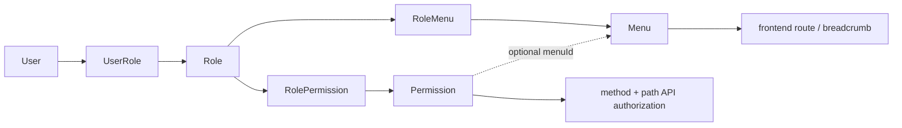

# API 設計書（manpower-blog-backend）

## 1. 前提

本書は `manpower-blog-backend` の現在の Controller、DTO、権限設計を基準にした API 設計書である。

バックエンド API は共通して `Result<T>` を返す。

```json
{
  "code": 200,
  "message": "success",
  "data": {},
  "traceId": "...",
  "timestamp": "..."
}
```

## 2. 認証

### 2.1 Login

| Method | Path | 説明 | 認証 |
|---|---|---|---|
| POST | `/api/system/auth/login` | ログインして JWT を発行する | 不要 |

Request:

```json
{
  "accountType": "USERNAME",
  "accountValue": "admin",
  "password": "password"
}
```

Response:

```json
{
  "token": "jwt-token",
  "user": {
    "userId": 1,
    "accountId": 1,
    "nickName": "admin"
  }
}
```

### 2.2 Logout / Me

| Method | Path | 説明 | 認証 |
|---|---|---|---|
| POST | `/api/system/auth/logout` | ログアウト | 必要 |
| GET | `/api/system/auth/me` | ログインユーザー、メニュー、権限コードを取得 | 必要 |

`/me` response:

```json
{
  "user": {
    "userId": 1,
    "accountId": 1,
    "nickName": "admin"
  },
  "menus": [
    {
      "id": 1,
      "parentId": 0,
      "name": "System",
      "path": "/system",
      "component": "SystemLayout",
      "type": 1,
      "children": []
    }
  ],
  "permissions": ["sys:menu:list", "sys:permission:create"]
}
```

## 3. API 認可

### 3.1 現行方式

API 認可は `DynamicAuthorizationManager` が担当する。Controller の `@PreAuthorize` は使用しない。

判定データ:

| Field | 説明 |
|---|---|
| `method` | HTTP method |
| `path` | API path |
| `code` | 権限コード |

判定フロー:

1. JWT filter が token を検証する。
2. `DynamicAuthorizationManager` が request method/path を取得する。
3. `PermissionRuleProvider.loadEnabledRules()` で有効な API 権限ルールを取得する。
4. request の `method + path` に一致するルールの `code` を特定する。
5. JWT filter が設定したユーザー Authority に `code` がなければ 403 を返す。
6. 一致するルール自体が存在しない場合も 403 を返す。

### 3.2 認可対象外

以下は動的 API 権限判定の対象外。

- `OPTIONS`
- `POST /api/system/auth/login`
- `GET /api/portal/**`
- `/error/**`
- `/favicon.ico`
- Swagger / OpenAPI / health endpoint

`/api/system/auth/me`、logout、`/api/system/menu/my-tree` はログイン済みであれば permission code なしで利用できる。

## 4. System API

Collection queries use `/page` for paged results and `/list` for non-paged
results. Java methods use `page`, `list`, `listEnabled`, `findById`, `create`,
`update`, `delete`, and `changeStatus` consistently across Controller,
application service, and repository layers.

### 4.1 User API

Base path: `/api/system/user`

| Method | Path | 権限 code 例 | 説明 |
|---|---|---|---|
| GET | `/page` | `sys:user:list` | ユーザー一覧をページング取得 |
| GET | `/{id}` | `sys:user:detail` | ユーザー詳細取得 |
| POST | `` | `sys:user:create` | ユーザー作成 |
| PUT | `/{id}` | `sys:user:update` | ユーザー更新 |
| DELETE | `/{id}` | `sys:user:delete` | ユーザー削除 |
| PATCH | `/{id}/status` | `sys:user:changeStatus` | ユーザー状態変更 |

### 4.2 Role API

Base path: `/api/system/role`

| Method | Path | 権限 code 例 | 説明 |
|---|---|---|---|
| GET | `/list` | `sys:role:list` | ロール一覧取得 |
| GET | `/{id}` | `sys:role:detail` | ロール詳細取得 |
| POST | `` | `sys:role:create` | ロール作成 |
| PUT | `/{id}` | `sys:role:update` | ロール更新 |
| DELETE | `/{id}` | `sys:role:delete` | ロール削除 |
| PATCH | `/{id}/status` | `sys:role:changeStatus` | ロール状態変更 |
| GET | `/{id}/authorization` | `sys:role:authorization:list` | メニュー、権限、選択済み ID を一括取得 |
| PUT | `/{id}/authorization` | `sys:role:assignAuthorization` | メニューと権限を同一トランザクションで保存 |

### 4.3 Permission API

Base path: `/api/system/permission`

| Method | Path | 権限 code 例 | 説明 |
|---|---|---|---|
| GET | `/page` | `sys:permission:list` | API 権限のページ一覧取得（keyword / menuId / method / status） |
| POST | `` | `sys:permission:create` | 権限作成 |
| GET | `/{id}` | `sys:permission:detail` | 権限詳細取得 |
| PUT | `/{id}` | `sys:permission:update` | 権限更新 |
| DELETE | `/{id}` | `sys:permission:delete` | 権限削除 |

Permission request の主な項目:

| Field | 説明 |
|---|---|
| `menuId` | 所属メニュー ID。未所属の共通権限は `null` |
| `name` | 権限名 |
| `code` | 権限コード |
| `path` | API path（必須） |
| `method` | HTTP method（必須） |
| `status` | 状態 |

### 4.4 Menu API

Base path: `/api/system/menu`

| Method | Path | 権限 code 例 | 説明 |
|---|---|---|---|
| GET | `/tree` | `sys:menu:list` | 管理用全メニューツリー取得 |
| GET | `/my-tree` | `sys:menu:list` | ログインユーザー用メニューツリー取得 |
| GET | `/tree/enabled` | `sys:menu:activeTree` | 有効メニューツリー取得 |
| GET | `/options` | `sys:menu:create` / `sys:menu:update` | 親メニュー候補取得 |
| GET | `/{id}` | `sys:menu:detail` | メニュー詳細取得 |
| POST | `` | `sys:menu:create` | メニュー作成 |
| PUT | `/{id}` | `sys:menu:update` | メニュー更新 |
| DELETE | `/{id}` | `sys:menu:delete` | メニュー削除 |
| PATCH | `/{id}/status` | `sys:menu:changeStatus` | メニュー状態変更 |

Menu request の主な項目:

| Field | 説明 |
|---|---|
| `parentId` | 親メニュー ID |
| `name` | メニュー名 |
| `path` | frontend route path。例: `/system/menu` |
| `component` | frontend component key。例: `system/menu/index` |
| `type` | ディレクトリ / メニュー |
| `sort` | 表示順 |
| `icon` | icon key |
| `status` | 状態 |

Permission の `menuId` は管理画面での分類・検索に利用する任意項目である。
API 認可そのものは role-permission の割当で判定する。

Permission は親子関係や MENU/BUTTON/API の種別を持たない。全レコードが実行可能な API 権限ルールである。

### 4.5 Article Management API

Base path: `/api/system/article`

| Method | Path | 権限 code 例 | 説明 |
|---|---|---|---|
| GET | `/page` | `content:article:list` | 下書き・公開・非公開を含む記事ページ一覧取得 |
| GET | `/{id}` | `content:article:detail` | 管理用記事詳細取得 |
| POST | `` | `content:article:create` | 記事作成。作成者 ID はログイン情報から設定 |
| PUT | `/{id}` | `content:article:update` | 記事更新 |
| DELETE | `/{id}` | `content:article:delete` | 記事論理削除 |
| PATCH | `/{id}/status` | `content:article:changeStatus` | 下書き・公開・非公開の状態変更 |

## 5. Portal API

### 5.1 Ping

| Method | Path | 説明 |
|---|---|---|
| GET | `/api/portal/ping` | 疎通確認 |

### 5.2 Article API

Base path: `/api/portal/article`

| Method | Path | 説明 |
|---|---|---|
| GET | `/page` | 公開済み記事のみページング取得 |
| GET | `/{id}` | 公開済み記事のみ詳細取得 |

Portal API は匿名閲覧専用であり、request から記事状態を受け取らない。記事の作成・更新・削除は Article Management API が担当する。会員向け投稿 API は member module 追加時に別途定義する。

## 6. Menu と Permission の関係

Menu と Permission は任意の `permission.menuId` で分類上の関連を持つ。
認可の割当は RolePermission が担当するため、メニュー表示権限とは独立している。



| データ | 使用箇所 |
|---|---|
| `menu.path` | sidebar 遷移、breadcrumb、frontend route matching |
| `menu.component` | 将来の dynamic route 用 component key |
| `permission.method` | API 認可 |
| `permission.path` | API 認可 |
| `permission.code` | 権限管理、role-permission 割当、UI ボタン制御 |

## 7. HTTP status / error

### 7.1 二つの応答形態

エラー応答は経路によって形が異なる。これは意図した設計であり、フロントエンドは双方を扱う必要がある。

| 発生元 | HTTP status | 本体 |
|---|---|---|
| 認証・認可（Security filter chain） | 401 / 403 | `Result` 形式（filter が直接書き出す） |
| 業務・検証・想定外（`GlobalExceptionHandler`） | **200** | `Result` の `code` にエラーコードを載せる |

認証・認可は Controller へ到達する前の filter 段で判定されるため、`@RestControllerAdvice` を通らない。この二形態は避けられるものではなく、隠すよりも明示する。

フロントエンドの `errorHandler.ts` は、axios の HTTP エラーと `code !== 200` の本体の双方を `ApiErrorPayload` へ正規化することでこの差を吸収する。

| 状態 | 返却 |
|---|---|
| 未認証 | 401 |
| API 権限なし | 403 + `{"code":403,"message":"permission denied"}` |
| 業務エラー | `Result` の code/message |
| validation error | `GlobalExceptionHandler` による共通 error response |

### 7.2 応答に例外詳細を含めない

`Result` は例外の詳細（`detail`）を持たない。内部実装の情報を API 利用者へ渡さないためである。

障害調査は `traceId` とサーバログで行う。`GlobalExceptionHandler` は詳細をログにのみ出力する。

> かつて `Result.detail` と `withDetail` が存在したが、常に null を代入する
> `safeDetail` を経由しており一度も応答へ載っていなかった。
> 一方でフロントエンドは `detail` をメッセージ解決の候補として参照しており、
> 両者の意図が食い違ったまま放置されていた。
> 空振りする番人だけを残すと詳細を返す口が無防備になるため、双方から撤去した。

### 7.3 入力検証エラーの形

`@RequestBody` の検証と、`@PathVariable` / `@RequestParam` の検証は Spring 内部で別の例外型となるが、応答形状は揃えている。

| 例外 | 発生源 |
|---|---|
| `MethodArgumentNotValidException` | `@RequestBody @Valid` |
| `HandlerMethodValidationException` | メソッド引数への制約（Spring 6.1 以降の内蔵検証） |
| `ConstraintViolationException` | クラスへの `@Validated`（現在は未使用） |

いずれも `code` は `VALIDATION_ERROR`、`data` は `ValidationErrors` を返す。`field` にはリクエストの項目名（経路変数の場合は引数名）が入る。

> 引数名の取得はコンパイル時の `-parameters` に依存する。無効になると
> `arg0` のような合成名となり、フロントエンドが項目を特定できなくなる。


## 8. フロントエンド連携メモ

- frontend は `VITE_API_BASE_URL` を baseURL として axios から呼び出す。
- token は `sessionStorage` に保存され、request interceptor で Bearer token として付与される。
- `/api/system/auth/me` の `menus` は sidebar と breadcrumb に使う。
- frontend route は静的定義を維持するため、`menu.path` は静的 route path と一致させる必要がある。
