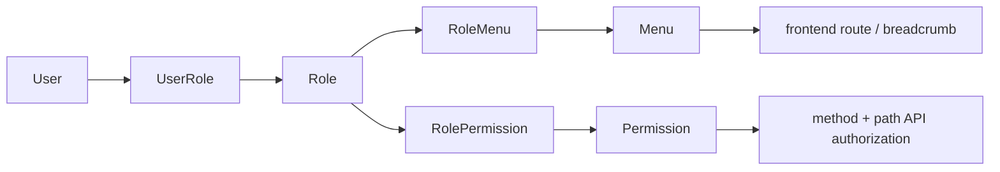

# API 設計書（manpower-blog-backend）

## 1. 前提

本書は `manpower-blog-backend` の現在の Controller、DTO、権限設計を基準にした API 設計書である。

バックエンド API は共通して `Result<T>` を返す。

```json
{
  "code": 200,
  "message": "success",
  "data": {},
  "traceId": "...",
  "timestamp": "..."
}
```

## 2. 認証

### 2.1 Login

| Method | Path | 説明 | 認証 |
|---|---|---|---|
| POST | `/api/system/auth/login` | ログインして JWT を発行する | 不要 |

Request:

```json
{
  "accountType": "USERNAME",
  "accountValue": "admin",
  "password": "password"
}
```

Response:

```json
{
  "token": "jwt-token",
  "user": {
    "userId": 1,
    "accountId": 1,
    "nickName": "admin"
  }
}
```

### 2.2 Logout / Me

| Method | Path | 説明 | 認証 |
|---|---|---|---|
| POST | `/api/system/auth/logout` | ログアウト | 必要 |
| GET | `/api/system/auth/me` | ログインユーザー、メニュー、権限コードを取得 | 必要 |

`/me` response:

```json
{
  "user": {
    "userId": 1,
    "accountId": 1,
    "nickName": "admin"
  },
  "menus": [
    {
      "id": 1,
      "parentId": 0,
      "name": "System",
      "path": "/system",
      "component": "SystemLayout",
      "type": 1,
      "children": []
    }
  ],
  "permissions": ["sys:menu:list", "sys:permission:create"]
}
```

## 3. API 認可

### 3.1 現行方式

API 認可は `PermissionAuthorizationFilter` が担当する。Controller の `@PreAuthorize` は使用しない。

判定データ:

| Field | 説明 |
|---|---|
| `method` | HTTP method |
| `path` | API path |
| `code` | 権限コード |

判定フロー:

1. JWT filter が token を検証する。
2. `PermissionAuthorizationFilter` が request method/path を取得する。
3. `UserAuthorityProvider.loadApiPermissions(userId)` でユーザーの API 権限を取得する。
4. permission の `method + path` と request の `method + path` を照合する。
5. 一致しなければ 403 を返す。

### 3.2 認可対象外

以下は API 権限 filter の対象外。

- `OPTIONS`
- `/api/system/auth/**`
- `/error/**`
- `/favicon.ico`
- `/api/system/**` と `/api/admin/**` 以外の path

## 4. System API

### 4.1 User API

Base path: `/api/system/user`

| Method | Path | 権限 code 例 | 説明 |
|---|---|---|---|
| GET | `/page` | `sys:user:list` | ユーザー一覧をページング取得 |
| GET | `/detail` | `sys:user:detail` | ユーザー詳細取得 |
| POST | `` | `sys:user:create` | ユーザー作成 |
| PUT | `` | `sys:user:update` | ユーザー更新 |
| DELETE | `` | `sys:user:delete` | ユーザー削除 |
| PATCH | `/status` | `sys:user:changeStatus` | ユーザー状態変更 |

### 4.2 Role API

Base path: `/api/system/role`

| Method | Path | 権限 code 例 | 説明 |
|---|---|---|---|
| GET | `/list` | `sys:role:list` | ロール一覧取得 |
| GET | `/{id}` | `sys:role:detail` | ロール詳細取得 |
| POST | `` | `sys:role:create` | ロール作成 |
| PUT | `/{id}` | `sys:role:update` | ロール更新 |
| DELETE | `/{id}` | `sys:role:delete` | ロール削除 |
| PATCH | `/{id}/status` | `sys:role:changeStatus` | ロール状態変更 |
| GET | `/{id}/permissions` | `sys:role:assignPermission` | ロールに紐づく権限 ID 一覧 |
| PUT | `/{id}/permissions` | `sys:role:assignPermission` | ロール権限を保存 |
| GET | `/{id}/menus` | `sys:role:assignMenu` | ロールに紐づくメニュー ID 一覧 |
| PUT | `/{id}/menus` | `sys:role:assignMenu` | ロールメニューを保存 |

### 4.3 Permission API

Base path: `/api/system/permission`

| Method | Path | 権限 code 例 | 説明 |
|---|---|---|---|
| GET | `/tree` | `sys:permission:list` | 権限ツリー取得 |
| GET | `/parent-options` | `sys:permission:create` / `sys:permission:update` | 親権限候補取得 |
| POST | `` | `sys:permission:create` | 権限作成 |
| GET | `/{id}` | `sys:permission:detail` | 権限詳細取得 |
| PUT | `/{id}` | `sys:permission:update` | 権限更新 |
| DELETE | `/{id}` | `sys:permission:delete` | 権限削除 |

Permission request の主な項目:

| Field | 説明 |
|---|---|
| `parentId` | 親権限 ID |
| `name` | 権限名 |
| `code` | 権限コード |
| `type` | 権限種別 |
| `path` | API path |
| `method` | HTTP method |
| `status` | 状態 |

### 4.4 Menu API

Base path: `/api/system/menu`

| Method | Path | 権限 code 例 | 説明 |
|---|---|---|---|
| GET | `/tree` | `sys:menu:list` | 管理用全メニューツリー取得 |
| GET | `/my-tree` | `sys:menu:list` | ログインユーザー用メニューツリー取得 |
| GET | `/active-tree` | `sys:menu:list` / `sys:role:assignMenu` | 有効メニューツリー取得 |
| GET | `/parent-options` | `sys:menu:create` / `sys:menu:update` | 親メニュー候補取得 |
| GET | `/{id}` | `sys:menu:detail` | メニュー詳細取得 |
| POST | `` | `sys:menu:create` | メニュー作成 |
| PUT | `/{id}` | `sys:menu:update` | メニュー更新 |
| DELETE | `/{id}` | `sys:menu:delete` | メニュー削除 |
| PATCH | `/{id}/status` | `sys:menu:changeStatus` | メニュー状態変更 |

Menu request の主な項目:

| Field | 説明 |
|---|---|
| `parentId` | 親メニュー ID |
| `name` | メニュー名 |
| `path` | frontend route path。例: `/system/menu` |
| `component` | frontend component key。例: `system/menu/index` |
| `type` | ディレクトリ / メニュー |
| `sort` | 表示順 |
| `icon` | icon key |
| `status` | 状態 |

Menu は permission id を持たない。API 認可とは独立している。

## 5. Portal API

### 5.1 Ping

| Method | Path | 説明 |
|---|---|---|
| GET | `/api/portal/ping` | 疎通確認 |

### 5.2 Article API

Base path: `/api/articles`

| Method | Path | 説明 |
|---|---|---|
| POST | `/add` | 記事作成 |
| GET | `/pageList` | 記事ページング取得 |
| PUT | `/update` | 記事更新 |
| DELETE | `/{id}` | 記事削除 |

## 6. Menu と Permission の分離

更新後の設計では、Menu と Permission は直接関連しない。



| データ | 使用箇所 |
|---|---|
| `menu.path` | sidebar 遷移、breadcrumb、frontend route matching |
| `menu.component` | 将来の dynamic route 用 component key |
| `permission.method` | API 認可 |
| `permission.path` | API 認可 |
| `permission.code` | 権限管理、role-permission 割当、UI ボタン制御 |

## 7. HTTP status / error

| 状態 | 返却 |
|---|---|
| 未認証 | 401 |
| API 権限なし | 403 + `{"code":403,"message":"permission denied"}` |
| 業務エラー | `Result` の code/message |
| validation error | `GlobalExceptionHandler` による共通 error response |

## 8. フロントエンド連携メモ

- frontend は `VITE_API_BASE_URL` を baseURL として axios から呼び出す。
- token は `sessionStorage` に保存され、request interceptor で Bearer token として付与される。
- `/api/system/auth/me` の `menus` は sidebar と breadcrumb に使う。
- frontend route は静的定義を維持するため、`menu.path` は静的 route path と一致させる必要がある。
