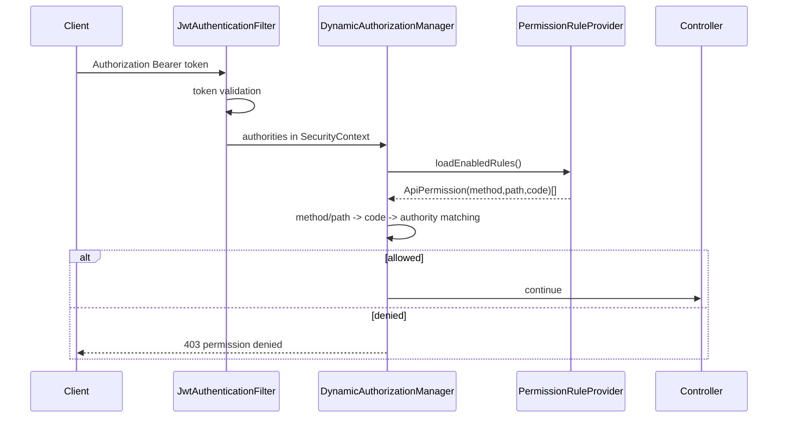
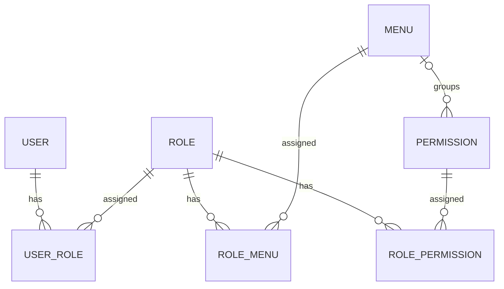

# manpower-blog-backend アーキテクチャ設計書

## 1. 目的

`manpower-blog-backend` は manpower-blog のバックエンド API プロジェクトである。管理画面向けの System API、公開側 Portal API、認証、RBAC、メニュー、権限、記事ドメインを Spring Boot 3 のマルチモジュール構成で提供する。

本設計書は現在のコードを正とし、特に以下の更新後設計を反映する。

- API 認可は `@PreAuthorize` ではなく、framework の `DynamicAuthorizationManager` で集中制御する。
- 権限は `method + path + code` の三位一体で管理する。
- メニューと権限の実行責務は分離し、権限の `menuId` は管理画面上の分類にのみ利用する。
- メニューは `path` と `component` を持ち、管理画面のナビゲーションとパンくずの元データになる。
- フロントエンドのルート定義は当面静的ルートを維持する。

## 2. モジュール構成

| Module | 役割 |
|---|---|
| `blog-starter` | Spring Boot 起動モジュール。アプリケーションのエントリポイント。 |
| `blog-admin-api` | 管理画面向け Controller。認証、ユーザー、ロール、権限、メニュー API を公開する。 |
| `blog-portal-api` | 公開側 Controller。記事 API、疎通確認 API を公開する。 |
| `blog-module-system` | system ドメイン。User、Role、Permission、Menu、Login の業務処理と永続化。 |
| `blog-module-content` | content ドメイン。Article の業務処理と永続化。 |
| `blog-framework` | 横断基盤。Spring Security、JWT、API 認可フィルタ、MyBatis、例外処理、Swagger、TraceId。 |
| `blog-common` | 共通 DTO、Result、例外、Enum、ユーティリティ。 |
| `blog-infra` | 開発支援、コード生成などの infra 補助。 |

依存方向は API -> module -> framework/common を基本とし、framework は system の実装詳細に依存しない。ユーザー別権限ロードは `UserAuthorityProvider` インターフェースで抽象化し、system 側の `SystemUserAuthorityProvider` が実装する。

## 3. レイヤ構成

### 3.1 Controller

配置先は `blog-admin-api` と `blog-portal-api`。

Controller は HTTP 入出力の境界であり、以下を担当する。

- `@RequestMapping` / `@GetMapping` などのエンドポイント定義
- `@Valid` による入力検証
- application service の呼び出し
- `Result<T>` 形式でのレスポンス返却

Controller では API 権限注解を持たない。認可は Spring Security の `DynamicAuthorizationManager` が実施する。

### 3.2 Application Service

配置先は主に `blog-module-system` と `blog-module-content`。

Application Service はユースケース単位の業務処理を担当する。

- DTO / VO / Entity の変換
- Repository 呼び出し
- 業務バリデーション
- `BizException` による業務例外

### 3.3 Domain / Repository / Mapper

Entity、Repository interface、Repository implementation、MyBatis Mapper/XML を組み合わせる。

system ドメインでは以下を中心に扱う。

- User / UserAccount / UserRole
- Role / RolePermission / RoleMenu
- Permission
- Menu

content ドメインでは Article を扱う。

### 3.4 Framework

`blog-framework` は以下の横断機能を提供する。

- `SecurityConfig`
- `JwtAuthenticationFilter`
- `DynamicAuthorizationManager`
- `JwtTokenProvider`
- `PasswordService`
- `GlobalExceptionHandler`
- MyBatis-Plus 設定
- Swagger / OpenAPI 設定
- TraceId filter / response advice

## 4. 認証設計

### 4.1 ログイン

ログイン API は `/api/system/auth/login`。

処理フロー:

1. クライアントが accountType、accountValue、password を送信する。
2. `LoginAppService` がアカウントとパスワードを検証する。
3. `JwtTokenProvider` が JWT を発行する。
4. フロントエンドは token を保存し、以降 `Authorization: Bearer <token>` を付与する。

### 4.2 JWT 認証

`JwtAuthenticationFilter` がリクエストの Bearer token を検証し、成功時に `SecurityContext` へ `LoginPrincipal` を設定する。

`LoginPrincipal` は以下のようなログイン主体情報を保持する。

- userId
- accountId
- username / nickname
- authorities

## 5. API 認可設計

### 5.1 方針

API 認可は `DynamicAuthorizationManager` で一元化する。Controller の `@PreAuthorize` は使用しない。

権限定義は `t_sys_permission` の以下 3 要素を中心に扱う。`menu_id` は管理 UI の分類用であり、認可判定には使用しない。

| Field | 意味 |
|---|---|
| `method` | HTTP method。例: `GET`, `POST`, `PUT`, `DELETE`, `PATCH` |
| `path` | API path。例: `/api/system/menu/{id}` |
| `code` | 権限コード。例: `sys:menu:detail` |

実際の API 判定では `method + path` で有効なルールを特定し、対応する `code` がログインユーザーの Authority に存在するかを照合する。ルール未登録のリクエストは拒否する。

### 5.2 Filter chain

`SecurityConfig` の概要:

- CSRF 無効
- CORS 有効
- Session は stateless
- `/api/system/auth/login`、公開記事 GET、疎通確認、API ドキュメントは permit
- `/api/system/auth/me`、logout、my-menu は authenticated-only
- その他はすべて `DynamicAuthorizationManager` で認可し、未登録ルールは拒否
- `JwtAuthenticationFilter` を username/password filter の前に配置
- `DynamicAuthorizationManager` を Spring Security の request authorization に設定

### 5.3 認可フロー

### 5.4 Path matching

`DynamicAuthorizationManager` は `AntPathMatcher` を使って path を照合する。

対応する形式:

- 完全一致: `/api/system/menu/tree`
- path variable: `/api/system/menu/{id}`
- pattern: `/api/system/menu/**`

親 path から子 path を暗黙に許可する fallback は使用しない。複数階層を許可する場合は `*` または `**` を権限 path に明示する。

## 6. RBAC 設計

### 6.1 関係

### 6.2 権限

権限は API アクセス制御専用のデータである。

- `Permission` は必須の `code`, `method`, `path` と `status` を持つ。
- `menuId` は任意で、ロール設定画面における権限のグループ表示に利用する。
- Permission 自体に親子関係や MENU/BUTTON/API 種別は持たせない。
- `RolePermission` で role と permission を紐づける。
- ユーザーの API 権限は `user -> role -> role_permission -> permission` で取得する。

### 6.3 メニュー

メニューは UI ナビゲーション専用のデータである。

- `Menu` は `path` と `component` を持つ。
- `RoleMenu` で role と menu を紐づける。
- ユーザーの表示可能メニューは `user -> role -> role_menu -> menu` で取得する。
- メニューは permission id を持たない。
- ロール設定ではメニューと権限を一つの `/authorization` API でまとめて取得・保存する。

この分離により、画面表示制御と API 認可制御を独立して変更できる。

## 7. Menu / Permission 分離後の責務

| 項目 | Menu | Permission |
|---|---|---|
| 主用途 | 画面ナビゲーション、パンくず | API 認可 |
| 主なキー | `path`, `component` | `method`, `path`, `code`（`menuId` は分類専用） |
| role 紐づけ | `t_sys_role_menu` | `t_sys_role_permission` |
| frontend での用途 | sidebar、breadcrumb、route permission | button permission、権限管理 UI |
| backend 認可での用途 | 使わない | 使う |

## 8. DB 設計概要

主要テーブル:

- `t_sys_user`
- `t_sys_user_account`
- `t_sys_role`
- `t_sys_user_role`
- `t_sys_permission`
- `t_sys_role_permission`
- `t_sys_menu`
- `t_sys_role_menu`

`t_sys_menu` は `permission_id` を持たない。`path` と `component` を持つ。

`t_sys_permission` は API 権限定義として `method`, `path`, `code` を持つ。

## 9. API グループ

| Group | Base path | Module |
|---|---|---|
| Auth | `/api/system/auth` | `blog-admin-api` |
| User | `/api/system/user` | `blog-admin-api` |
| Role | `/api/system/role` | `blog-admin-api` |
| Permission | `/api/system/permission` | `blog-admin-api` |
| Menu | `/api/system/menu` | `blog-admin-api` |
| Portal Ping | `/api/portal/ping` | `blog-portal-api` |
| Article | `/api/articles` | `blog-portal-api` |

## 10. フロントエンド連携

フロントエンドは `/api/system/auth/me` で以下を取得する。

- login user
- menus
- permissions

`menus` は sidebar と breadcrumb に利用する。`permissions` は必要に応じてボタン表示などの UI 制御に利用する。

現在の frontend route は静的定義である。menu の `path` は静的 route と一致させ、動的 route 生成は将来拡張とする。

## 11. 今後の拡張

- DynamicAuthorizationManager の権限ロード結果を cache する場合は、必要になった段階で cache 基盤を追加する。
- permission path の pattern 設計を管理画面で明確化する。
- frontend dynamic route を導入する場合、menu `component` と frontend component registry を対応させる。
- portal API の認可要否を公開/会員/API 権限に分けて整理する。
