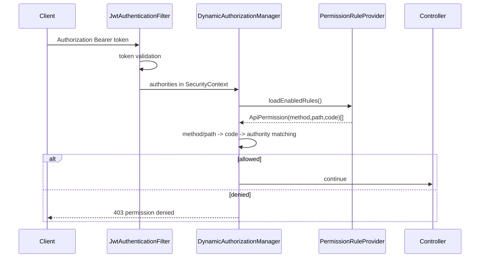
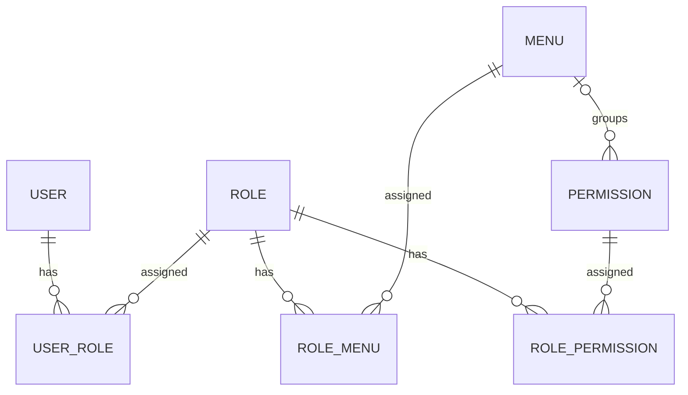

# manpower-blog-backend アーキテクチャ設計書

## 1. 目的

`manpower-blog-backend` は manpower-blog のバックエンド API プロジェクトである。管理画面向けの System API、公開側 Portal API、認証、RBAC、メニュー、権限、記事ドメインを Spring Boot 3 のマルチモジュール構成で提供する。

本設計書は現在のコードを正とし、特に以下の更新後設計を反映する。

- API 認可は `@PreAuthorize` ではなく、framework の `DynamicAuthorizationManager` で集中制御する。
- 権限は `method + path + code` の三位一体で管理する。
- メニューと権限の実行責務は分離し、権限の `menuId` は管理画面上の分類にのみ利用する。
- メニューは `path` と `component` を持ち、管理画面のナビゲーションとパンくずの元データになる。
- フロントエンドのルート定義は当面静的ルートを維持する。

## 2. モジュール構成

| Module | 役割 |
|---|---|
| `blog-starter` | Spring Boot 起動モジュール。アプリケーションのエントリポイント。 |
| `blog-admin-api` | 管理画面向け Controller。System API と記事管理 API を公開する。 |
| `blog-portal-api` | 匿名公開側 Controller。公開済み記事の参照 API、疎通確認 API を公開する。 |
| `blog-module-system` | system ドメイン。User、Role、Permission、Menu、Login の業務処理と永続化。 |
| `blog-module-content` | content ドメイン。Article の業務処理と永続化。 |
| `blog-module-member` | member ドメイン。会員機能の業務処理と永続化（構築中）。 |
| `blog-member-api` | 会員画面向け Controller（構築中）。 |
| `blog-framework` | 横断基盤。Spring Security、JWT、API 認可フィルタ、MyBatis、例外処理、Swagger、TraceId。 |
| `blog-common` | 共通 DTO、Result、例外、Enum、ドメインガード、ユーティリティ。 |
| `blog-infra` | 開発支援、コード生成などの infra 補助。 |

### 2.1 パッケージ命名規約

ルートは `com.manpowergroup.blog`。モジュール境界がパッケージ名から一意に読み取れることを優先する。

| Prefix | 対象 |
|---|---|
| `com.manpowergroup.blog.bootstrap` | 起動モジュール |
| `com.manpowergroup.blog.api.<面>` | Controller（`admin` / `portal` / `member`） |
| `com.manpowergroup.blog.module.<ドメイン>` | 業務モジュール（`system` / `content` / `member`） |
| `com.manpowergroup.blog.framework` | 横断基盤 |
| `com.manpowergroup.blog.shared` | 共通 DTO・例外・Enum・ガード |

業務モジュール配下は `application` / `domain` / `infrastructure` の3層に限定する。第4のトップレベルパッケージを追加しない（アダプタ実装は `infrastructure` 配下へ置く）。

> 注意：`LayerDependencyTest` はパッケージ名を**文字列**で指定している。
> パッケージ構成を変更した際は必ず同テストの定数も更新すること。
> 更新漏れがあると対象0件となり、ルールが空振りしたまま成功する。

依存方向は API -> module -> framework/common を基本とし、framework は system の実装詳細に依存しない。ユーザー別権限ロードは `UserAuthorityProvider` インターフェースで抽象化し、system 側の `SystemUserAuthorityProvider` が実装する。

## 3. レイヤ構成

### 3.1 Controller

配置先は `blog-admin-api` と `blog-portal-api`。

Controller は HTTP 入出力の境界であり、以下を担当する。

- `@RequestMapping` / `@GetMapping` などのエンドポイント定義
- `@Valid` による入力検証
- application service の呼び出し
- `Result<T>` 形式でのレスポンス返却

Controller では API 権限注解を持たない。認可は Spring Security の `DynamicAuthorizationManager` が実施する。

### 3.2 Application Service

配置先は各業務モジュール。ユースケース単位の手続きを担当する。

- 入力は `application.command` / `application.query` のコマンド・クエリオブジェクト
- 出力は `application.dto.response` のレスポンスオブジェクト
- 複数集約にまたがる手続きの調整
- Repository / ポート経由での永続化・外部技術アクセス

Application Service は MyBatis-Plus の `IService` / `ServiceImpl` を継承しない。ORM の CRUD がユースケース契約へ露出すると、Controller から集約の不変条件を迂回できてしまうためである。同じ理由で `Mapper` と `framework` の具象クラスも直接参照しない。

### 3.3 Domain

ドメインモデルは業務ルールを内部に保持する（充血モデル）。

- public setter を持たない（`@Data` / `@Setter` / `@Builder` は使用しない）
- 生成は静的ファクトリメソッド経由とし、private コンストラクタ内で不変条件を検証する
- 状態変更は意図を表す振る舞いメソッドで公開する（`changeStatus` / `updateProfile` 等）
- 「呼び忘れると不正状態が残る validate」は作らない

system ドメインの主な構成要素:

- User / UserAccount / UserRole
- Role / RoleAuthorization / RolePermission / RoleMenu
- Permission / UserAuthorities
- Menu

content ドメインでは Article を扱う。

### 3.4 Infrastructure

Repository 実装、MyBatis Mapper/XML、および framework ポートのアダプタ実装を配置する。

`framework` が定義するポート（`UserAuthorityProvider`、`PermissionRuleProvider`）の実装は、モジュール直下ではなく `infrastructure.security` 配下へ置く。これらは外部技術との接続点であり、3層構造の外に第4のパッケージを作らないためである。

### 3.5 Framework

`blog-framework` は以下の横断機能を提供する。

- `SecurityConfig`
- `JwtAuthenticationFilter`
- `DynamicAuthorizationManager`
- `JwtTokenProvider`
- `PasswordService`
- `GlobalExceptionHandler`
- MyBatis-Plus 設定
- Swagger / OpenAPI 設定
- TraceId filter / response advice

## 4. 認証設計

### 4.1 ログイン

ログイン API は `/api/system/auth/login`。

処理フロー:

1. クライアントが accountType、accountValue、password を送信する。
2. `LoginAppService` がアカウントとパスワードを検証する。
3. `JwtTokenProvider` が JWT を発行する。
4. フロントエンドは token を保存し、以降 `Authorization: Bearer <token>` を付与する。

### 4.2 JWT 認証

`JwtAuthenticationFilter` がリクエストの Bearer token を検証し、成功時に `SecurityContext` へ `LoginPrincipal` を設定する。

`LoginPrincipal` は以下のようなログイン主体情報を保持する。

- userId
- accountId
- username / nickname
- authorities

## 5. API 認可設計

### 5.1 方針

API 認可は `DynamicAuthorizationManager` で一元化する。Controller の `@PreAuthorize` は使用しない。

権限定義は `t_sys_permission` の以下 3 要素を中心に扱う。`menu_id` は管理 UI の分類用であり、認可判定には使用しない。

| Field | 意味 |
|---|---|
| `method` | HTTP method。例: `GET`, `POST`, `PUT`, `DELETE`, `PATCH` |
| `path` | API path。例: `/api/system/menu/{id}` |
| `code` | 権限コード。例: `sys:menu:detail` |

実際の API 判定では `method + path` で有効なルールを特定し、対応する `code` がログインユーザーの Authority に存在するかを照合する。ルール未登録のリクエストは拒否する。

ただしワイルドカード Authority `*` を保持する場合は、ルールを読み込まず即座に許可する。

「どのロールが全権限を持つか」は業務ルールであり、`DynamicAuthorizationManager` はこれを判定しない。framework 層はロール名を一切持たず、`*` の有無のみを機械的に解釈する。特権ロールの定義と実効権限の算出は system ドメインの `UserAuthorities` に一元化されており、画面制御（`/me` API のレスポンス）と API 認可は必ず同一のルールから導出される。

### 5.2 Filter chain

`SecurityConfig` の概要:

- CSRF 無効
- CORS 有効
- Session は stateless
- `/api/system/auth/login`、公開記事 GET、疎通確認、API ドキュメントは permit
- `/api/system/auth/me`、logout、my-menu は authenticated-only
- その他はすべて `DynamicAuthorizationManager` で認可し、未登録ルールは拒否
- `JwtAuthenticationFilter` を username/password filter の前に配置
- `DynamicAuthorizationManager` を Spring Security の request authorization に設定

### 5.3 認可フロー



### 5.4 Path matching

`DynamicAuthorizationManager` は `AntPathMatcher` を使って path を照合する。

対応する形式:

- 完全一致: `/api/system/menu/tree`
- path variable: `/api/system/menu/{id}`
- pattern: `/api/system/menu/**`

親 path から子 path を暗黙に許可する fallback は使用しない。複数階層を許可する場合は `*` または `**` を権限 path に明示する。

## 6. RBAC 設計

### 6.1 関係



### 6.2 権限

権限は API アクセス制御専用のデータである。

- `Permission` は必須の `code`, `method`, `path` と `status` を持つ。
- `menuId` は任意で、ロール設定画面における権限のグループ表示に利用する。
- Permission 自体に親子関係や MENU/BUTTON/API 種別は持たせない。
- `RolePermission` で role と permission を紐づける。
- ユーザーの API 権限は `user -> role -> role_permission -> permission` で取得する。

### 6.3 メニュー

メニューは UI ナビゲーション専用のデータである。

- `Menu` は `path` と `component` を持つ。
- `RoleMenu` で role と menu を紐づける。
- ユーザーの表示可能メニューは `user -> role -> role_menu -> menu` で取得する。
- メニューは permission id を持たない。
- ロール設定ではメニューと権限を一つの `/authorization` API でまとめて取得・保存する。

この分離により、画面表示制御と API 認可制御を独立して変更できる。

## 7. Menu / Permission 分離後の責務

| 項目 | Menu | Permission |
|---|---|---|
| 主用途 | 画面ナビゲーション、パンくず | API 認可 |
| 主なキー | `path`, `component` | `method`, `path`, `code`（`menuId` は分類専用） |
| role 紐づけ | `t_sys_role_menu` | `t_sys_role_permission` |
| frontend での用途 | sidebar、breadcrumb、route permission | button permission、権限管理 UI |
| backend 認可での用途 | 使わない | 使う |

## 8. DB 設計概要

主要テーブル:

- `t_sys_user`
- `t_sys_user_account`
- `t_sys_role`
- `t_sys_user_role`
- `t_sys_permission`
- `t_sys_role_permission`
- `t_sys_menu`
- `t_sys_role_menu`

`t_sys_menu` は `permission_id` を持たない。`path` と `component` を持つ。

`t_sys_permission` は API 権限定義として `method`, `path`, `code` を持つ。

## 9. API グループ

| Group | Base path | Module |
|---|---|---|
| Auth | `/api/system/auth` | `blog-admin-api` |
| User | `/api/system/user` | `blog-admin-api` |
| Role | `/api/system/role` | `blog-admin-api` |
| Permission | `/api/system/permission` | `blog-admin-api` |
| Menu | `/api/system/menu` | `blog-admin-api` |
| Article Management | `/api/system/article` | `blog-admin-api` |
| Portal Ping | `/api/portal/ping` | `blog-portal-api` |
| Published Article | `/api/portal/article` | `blog-portal-api` |

## 10. フロントエンド連携

フロントエンドは `/api/system/auth/me` で以下を取得する。

- login user
- menus
- permissions

`menus` は sidebar と breadcrumb に利用する。`permissions` は必要に応じてボタン表示などの UI 制御に利用する。

現在の frontend route は静的定義である。menu の `path` は静的 route と一致させ、動的 route 生成は将来拡張とする。

## 11. DDD 設計判断

本プロジェクトは厳密な DDD ではなく、保守コストとのバランスを取った実用的な設計を採用している。本章では「何を採用し、何を意図的に採用しなかったか」を記録する。

### 11.0 結合に関する判断基準

疎結合は原則である。ただし原則の厳守が業務上の利点を損なう場合、以下の条件をすべて満たすときに限り部分結合を許容する。

1. **業務上の明確な利点があること** — 利用者の理解しやすさや運用効率に実際に寄与する
2. **中核ロジックへ影響しないこと** — 認可・認証・ドメイン不変条件の判定に混入しない
3. **境界を構造で担保できること** — 規約ではなく、型・投影・テストで越境を検知できる
4. **判断理由を文書化すること** — なぜ許容したかを本章に記録する

条件3が重要である。「使わない約束」は後任者に引き継がれないが、「受け取れない構造」は引き継がれる。結合を許容する場合は必ず、越境しようとした時点で気付ける仕組みを併せて用意する。

逆に、上記を満たさない結合（依存方向が逆転する、中核判定に混入する、境界を検知できない）は許容しない。廃止した `t_sys_menu.permission_id` がその例である（詳細は 11.8）。

### 11.1 レイヤ依存方向

業務モジュール内部の依存方向は **infrastructure → domain ← application** とする。domain 層は application / infrastructure / framework / Spring のいずれにも依存しない。

この制約は `LayerDependencyTest`（ArchUnit）がテストとして固定し、CI で強制する。レビューだけでは容易に崩れるためである。

検証しているルール:

| ルール | 内容 |
|---|---|
| domain → application 禁止 | ドメインが上位層の DTO / VO を知らない |
| domain → infrastructure 禁止 | ドメインが永続化実装を知らない |
| domain → framework 禁止 | ドメインが横断基盤を知らない |
| domain → Spring / Servlet 禁止 | ドメインがフレームワーク非依存である |
| application → infrastructure 禁止 | ユースケースが実装詳細に依存しない |
| application → MyBatis-Plus 禁止 | ORM への依存を infrastructure に閉じる |
| application → framework 禁止 | 具象ではなく domain のポートを介す |
| Mapper の外部参照禁止 | Mapper を infrastructure 内部に閉じる |

同テストには「各レイヤのクラスが1件以上読み込めていること」を確認する番人テストを併設している。ArchUnit の `noClasses().that().resideInAPackage(X)` は X が0件の場合に無条件で成功するため、パッケージ指定の誤りがルールの空振りとして表面化しないのを防ぐ目的である。

> ArchUnit 専用エンジン（`archunit-junit5` の `@ArchTest`）は JUnit Platform 1.11 系でルールが検出されず、テスト0件のまま成功扱いになる事象を確認したため、コア API を通常の `@Test` から呼び出す方式を採用している。

### 11.2 責務の配置基準

| 判定 | 配置先 | 例 |
|---|---|---|
| 自身の状態のみで判定できる規則 | エンティティ | `User#ensureLoginAllowed` |
| 生成時の不変条件 | ファクトリメソッド + private コンストラクタ | `Permission#create` |
| 永続化層への問い合わせが必要な規則 | ドメインサービス | 一意性チェック |
| 複数集約にまたがる手続き | アプリケーションサービス | `UserAppService#create` |
| 形式規約を持つ単一の値 | 値オブジェクト | `UserAuthorities` |
| 外部技術への依存 | domain にポート、infrastructure にアダプタ | `PasswordEncryptor` |

### 11.3 ドメイン例外の方針

ドメイン層の不変条件違反は `DomainGuard`（`blog.shared.support`）を経由し、`BizException`（HTTP 400）として送出する。

`IllegalArgumentException` および `Objects.requireNonNull` は使用しない。これらは `GlobalExceptionHandler` に登録されておらず、汎用ハンドラへ落ちて **HTTP 500** を返してしまうためである。「入力不正なのにサーバーエラー」という誤ったレスポンスを構造的に防ぐ。

`DomainGuard` は `requireNonNull` / `requireText` / `normalizeText` / `requireNonNegative` / `requireTrue` を提供し、各モデルに重複していた検証ヘルパーを集約している。

### 11.4 認証ロジックのドメイン集約

パスワード照合はログインの中核業務ルールだが、ハッシュ方式（BCrypt）はインフラの関心事である。そのため domain 層に `PasswordEncryptor` ポートを定義し、`infrastructure.security.BCryptPasswordEncryptor` が framework の `PasswordService` へ委譲する。

ポートの実装を framework 側に置かない理由は、モジュール依存方向が module → framework であり、framework から module のインターフェースを参照できないためである。アダプタを infrastructure に置くことで依存方向を保ったまま依存性逆転を実現している。

結果として `UserAccount#authenticate` がユーザー状態・アカウント状態・認証状態・パスワード照合を一括で検証し、ログイン規則がドメインモデル内で完結する。

### 11.5 実効権限の一元化

「管理者ロールは全権限を持つ」という業務ルールは、画面のボタン制御（`/me`）と API 認可（`DynamicAuthorizationManager`）の双方が必要とする。

以前はこのルールが Controller と framework の2箇所に、素のロールコードと `ROLE_` 接頭辞付き Authority という**異なる表現**で重複していた。特権ロールを追加する際に片方だけ修正され、「画面にボタンは出るが API は 403」という不整合を生む危険があった。

現在は `UserAuthorities`（値オブジェクト）が唯一の判定元である。

- `effectivePermissionCodes()` — 画面制御用。特権ロール保持者にはワイルドカード1件を返す
- `toGrantedAuthorities()` — API 認可用。ロールに `ROLE_` を付与し実効権限を連結する

特権ロールを追加する場合は `UserAuthorities.SUPER_ADMIN_ROLES` のみを変更する。

### 11.6 参照系の扱い

一覧・ツリー・JOIN を伴う参照系はドメインモデルを経由せず、読み取り専用モデル（`SearchCriteria` / `SearchPage` / `Profile`）へ直接マッピングする。

採用理由:

- 参照系にドメインの不変条件は不要であり、モデルを経由すると過剰なオブジェクト生成を招く
- ドメインモデルが画面都合の項目に引きずられることを防げる

読み取り専用モデルは domain 配下に定義する。これにより Repository インターフェースが application 層の DTO / VO を参照する必要がなくなり、依存方向が保たれる。

### 11.7 永続化アノテーションをドメインモデルに残す判断

厳密な DDD ではドメインモデルは永続化技術から独立すべきであり、PO（Persistence Object）とドメインモデルを分離する方式が理想である。

本プロジェクトでは以下の理由により、ドメインモデルに MyBatis-Plus のアノテーションを残す方式を採用した。

- モデル数に対して変換コードの量が過大になり、保守コストが利点を上回ると判断したため
- 論理削除（`@TableLogic`）・自動採番フィールド（`@TableField(fill)`）は全モデル共通であり、変換層で再実装する意義が薄いため
- 将来 ORM を差し替える蓋然性が低いため

ただしビジネスルールは全てドメインモデル内に閉じており、アノテーション以外の永続化関心事（SQL・Wrapper・Mapper）は infrastructure 層に隔離している。

この判断に整合させるため、`LayerDependencyTest` には「domain が `com.baomidou` に依存しない」ルールを**あえて定義していない**。ルールと実際の設計判断が食い違うとテストが形骸化するためである。

### 11.8 Permission と Menu の関係 — 意図的な部分結合

#### 設計判断

`t_sys_permission` は `menu_id` を保持する。これは「どのメニュー配下の操作か」という管理 UI 上の分類を表すための項目であり、**API 認可判定には一切使用しない**。

完全な疎結合が原則として望ましいことは前提としたうえで、本項目については以下の理由から意図的に部分結合を選択した。

- 管理者にとって「ユーザー管理」はメニューと権限が一体の概念であり、権限付与画面でメニュー単位にグルーピングして提示するのが最も自然である
- 分類用に独立した権限グループ体系を新設すると、メニューツリーとほぼ同形の分類体系が二重に存在し、手動同期が必要になる。メニュー追加時のグループ作成漏れという新たな不整合要因を生む
- 既存の分類体系を再利用する方が、第二の分類体系を発明するより正確かつ低コストである

結合を許容する条件は「業務上の利点があり、かつ中核ロジックへ影響しないこと」である。本項目はこの条件を満たす。

#### かつての `t_sys_menu.permission_id` との違い

同じ「結合」でも、以前廃止した `t_sys_menu.permission_id` とは性質が異なる。

| | `menu.permission_id`（廃止） | `permission.menu_id`（現行） |
|---|---|---|
| 依存の向き | メニュー → 権限 | 権限 → メニュー |
| 意味 | メニューの成立に権限定義が必要 | 権限が分類ラベルを持つだけ |
| 影響範囲 | 権限変更がナビゲーションに波及 | 管理画面の表示グルーピングのみ |
| 中核ロジックへの影響 | ルーティング判定に混入 | 認可判定は参照しない |

前者はメニュー（フロントエンドの関心事）が自身を定義するために権限を知る必要があり、依存方向として不健全だった。後者は権限が分類ラベルを持つのみで、その語彙がたまたまメニューツリーである、という関係にすぎない。

DDD の観点でも、集約間を ID で参照することは推奨される形である。禁じられるのは集約間のオブジェクト参照および集約をまたぐトランザクション整合性であり、本項目はいずれにも該当しない。

#### 結合を封じ込める仕組み

「認可判定に使わない」を規約ではなく構造で担保する。

権限ルールを framework 層へ渡す際、`Permission` は `ApiPermission` へ投影される。

```java
new ApiPermission(code, path, method)
```

この投影の時点で `menu_id` は構造的に脱落する。`DynamicAuthorizationManager` は `menu_id` を「読まない」のではなく、**そもそも受け取っていない**。

したがって守るべき境界は「`menu_id` を持つか否か」ではなく、**`ApiPermission` に認可以外の項目を追加しないこと**である。将来 `menu_id` を認可判定へ持ち込もうとすれば `ApiPermission` の定義変更が必要となり、レビューで検知できる。

#### 関心事の分離は維持する

分類ラベルを共有することと、責務を混同することは別である。以下の区別は引き続き維持する。

- `menu.path` — フロントエンドのルーティング・ナビゲーション用
- `permission.path` — バックエンドの API 認可マッチング用

両者は名称が同じでも意味が異なり、一方から他方を導出してはならない。

#### 運用上の取り決め

**未分類は `NULL` で表す。`0` は使用しない。**

`t_sys_menu.parent_id` では `0` が「最上位」を意味する。同一システム内で `0` に二つの意味を持たせると混乱を招くため、`menu_id` の欠損は `NULL` とする。`0` は「存在しないメニューID」として振る舞い、`LEFT JOIN` の結果を静かに歪める点でも不適切である。

**メニュー削除は権限を理由に阻止しない。**

`menu_id` は分類ラベルであり認可に影響しないため、これを理由にメニューの構造変更を阻むのは責務として過剰である。削除時は同一トランザクション内で配下権限を未分類（`NULL`）へ移し、メニューを論理削除する。権限自体は有効なまま残り、API 認可への影響はない。

ただし削除前に件数を提示し、管理者が影響を把握したうえで判断できるようにする。阻止ではなく告知とする。

> 実装上の注意：分類表示のクエリで `LEFT JOIN t_sys_menu` する際、`is_deleted = 0` の条件は必ず `ON` 句に書く。`WHERE` 句に書くと `LEFT JOIN` が実質 `INNER JOIN` に退化し、未分類権限が一覧から消える。
>
> また、削除済みメニューを指したままの `menu_id` が残ると、その権限は有効な分類にも未分類にも該当せず画面から消失する。認可は正常に動作するため発見が遅れやすい。上記の「削除時に未分類へ移す」処理は、この事象を防ぐためにも必要である。

#### 権限コードと API パスの命名が一致しない理由

以下は誤りではなく意図した設計である。

```
content:article:list            ← 権限コードはドメイン名（content）
GET /api/system/article/page    ← パスは接入面（system）
```

権限コードは「どのドメインのどのリソースに何をするか」を表し、リクエストの入口とは独立である。一方 API パスの `/api/system/` は「管理画面向けの接入面」を意味し、ドメイン名ではない。

実際 Article は content ドメインに属したまま、二つの接入面を持つ。

| 接入面 | パス | Application Service |
|---|---|---|
| 管理画面向け | `/api/system/article` | `AdminArticleAppService` |
| 匿名公開向け | `/api/portal/article` | `PublishedArticleQueryService` |

コードは `blog-module-content` に集約されており、`blog-module-system` へ移動していない。

したがって権限コードを `sys:article:list` へ「修正」してはならない。将来 member 側から記事投稿を行う場合、`content:article:create` はそのまま再利用できるが、`sys:` 接頭辞では実態と乖離する。

### 11.9 ページング方式を一律にしない

#### 設計判断

一覧検索のページング方式は、結合の有無によって使い分ける。

| 条件 | 方式 |
|---|---|
| 複数テーブルを結合する検索 | `list` + `count`（XML で手書き） |
| 単表検索 | MyBatis-Plus の `selectPage`（`LambdaQueryWrapper`） |

統一した方が読みやすいという意見はあり得るが、単表検索を `list` + `count` へ揃えると劣った実装を選ぶことになるため採らない。

#### 結合検索を手書きにする理由

`t_sys_user` の一覧は `t_sys_user_account` / `t_sys_user_role` / `t_sys_role` を結合する。ページングプラグインを用いる場合、以下の制約がある。

- 生成される count SQL は元クエリの結合を保持する。手書きであれば行数に影響しない結合を除去する余地があるが、プラグインでは介入できない
- 件数取得と一覧取得が一体であるため、**該当0件でも一覧の SQL が発行される**

後者を避けるために `count` を分離し、0件の場合は `PageResult.empty()` で短絡する。

#### 手書き時の注意点

`list` と `count` は別の SQL 文となるため、結合や絞り込み条件がずれると `total` のみが静かに誤る。テストでもコンパイラでも検出できない。

これを構造的に防ぐため、**FROM 句と WHERE 句は `<sql>` 片へ抽出し、両者から `<include>` する**。条件を追加する際に片方だけ更新するという事故が起こり得なくなる。

```xml
<sql id="User_Page_From_Where">
    FROM t_sys_user u
    INNER JOIN ...
    <where>...</where>
</sql>
```

あわせて `ORDER BY` を必ず指定する。プラグイン利用時は表面化しにくいが、`LIMIT` / `OFFSET` を手書きする場合、並び順が不定だとページ間で行の重複・欠落が発生する。

#### 単表検索を `selectPage` のままとする理由

単表検索では、上記の利点がいずれも成立しない。

- 結合が無いため count から除去できるものが無い
- `LambdaQueryWrapper` を1つ生成して `selectList` と `selectCount` の双方へ渡すため、**条件がずれる余地が構造的に存在しない**。`<sql>` 片による防御が不要である
- 単表の `COUNT` は安価であり、0件短絡の利得が小さい

さらに、拆分すると `LIMIT` / `OFFSET` の指定に `last()` を用いることになる。これは生 SQL の文字列連結であり、`PageQuery` で型として扱えるようにした値を文字列へ戻すことになる。方向が逆である。

判断基準は「統一されているか」ではなく「その方式を採る理由がその検索に存在するか」とする。

### 11.10 契約と内部モデルの分離

#### `shared` を用途で分割する

`shared` 配下は一律に中立ではない。domain 層が依存してよいかを基準に分割する。

| パッケージ | 内容 | domain からの参照 |
|---|---|---|
| `shared/api` | `Result` / `PageResult` / `LoginResponse` | **不可** |
| `shared/dto` | `PageRequest` / `PageQuery` / `PageLimits` / `LoginUser` | 可 |

`shared/api` は HTTP 応答の形状である。`@Schema` を持ち、総ページ数のようにフロントエンドのページャ描画の都合で決まる派生値を含む。domain 層がこれに依存すると、表示要件の変更がリポジトリのインタフェースを揺らす向きの依存が生まれる。

この境界は `LayerDependencyTest` が強制する。規約として書くだけでは守られないため、テストで固定する。

#### 命名は実装方式ではなく役割に合わせる

`PageResult` は当初 `JoinPageResult` という名称であり、複数テーブル結合検索専用という意図を持っていた。しかし実際には単表検索の応答にも使用されており、名称と用途が乖離していた。

HTTP 応答の契約は、バックエンドが何テーブルを結合したかとは無関係である。フロントエンドにとって差は無い。実装方式を名称へ持ち込むと、11.9 のように方式を使い分けた際に名称が実態と合わなくなる。

#### 外部入力と内部の確定値を型で分ける

ページング値は2つの型で扱う。

| 型 | 生成タイミング | 不正値の扱い |
|---|---|---|
| `PageRequest` | Spring による HTTP パラメータのバインド時 | 補正のみ。例外を投げない |
| `PageQuery` | application 層（Assembler / AppService） | 範囲外は `BizException` |

`PageRequest` で例外を投げてはならない。生成は Controller 到達前に行われるため、`GlobalExceptionHandler` が捕捉できず HTTP 500 となる。

`PageQuery` は2つのファクトリを持ち、呼び出し元の信頼度で使い分ける。

- `clamped(...)` — 外部入力向け。範囲外は上下限へ丸める
- `of(...)` — 内部呼び出し向け。範囲外は実装の誤りであり拒否する

上下限は運用方針であり型固有の性質ではないため、正規コンストラクタでは「1以上」のみを強制し、上限はファクトリの責務とする。

上下限値は `app.page.*` から与えるが、`PageQuery` が `@ConfigurationProperties` を直接参照すると値オブジェクトが Spring へ依存する。間に Spring 非依存の `PageLimits` を挟み、`PageProperties#toLimits()` で変換する。

#### リポジトリは検証済みの値を受け取る

```java
// 誤り: 隣接する同型引数は取り違えても発見できない
UserSearchPage page(UserSearchCriteria criteria, Long pageNum, Long pageSize);

// 正: 単一の値オブジェクトとして受け取る
List<UserView> list(UserSearchCriteria criteria, PageQuery page);
```

`page(criteria, pageSize, pageNum)` はコンパイルが通り、テストでも検出できない。型で防ぐ。

#### 数値コード列挙のクエリパラメータ変換

DB へ数値コードとして保存される列挙は `CodedEnum` を実装する。

`@JsonCreator` は Jackson による JSON ボディの逆シリアライズ時にのみ働く。クエリパラメータは Spring の `ConversionService` を通るため、既定では列挙名でしか解決できない。結果として「応答は数値、要求は列挙名」という非対称が生じ、応答に含まれる `userStatus: 1` をそのまま `?status=1` として送り返すと 422 になる。

`CodedEnumConverterFactory` がこの差を埋める。`ConverterFactory` は登録対象を型で絞るため、共通インタフェースが必要になる。リフレクションで `@EnumValue` を探す方式も可能だが、それは暗黙の規約であり、構造で担保する方針に反する。

コードが文字列である列挙（`AccountType` 等）は対象外とする。コードと列挙名が一致しており、既定の変換で解決できる。

実装漏れは `EnumConventionTest` が検出する。

## 12. 今後の拡張

- 記事管理メニューを追加し、`content:article:*`（id 1039〜1044）の `menu_id` を紐付ける。
  現状これら6件は未分類（`NULL`）だが、権限自体は有効で ROLE(id=1) へ付与済みであり、
  `ArticleController` の6エンドポイントと1対1で対応している。管理画面のグルーピング表示のみが未整備。
  想定値：`parent_id=1`（システム管理配下）、`type=2`、`path=/system/article`。
  フロントエンドの該当画面・ルート追加とあわせて対応する。
- 未使用のテストメニュー（`t_sys_menu.id=10`）を削除する。`t_sys_role_menu` からの参照は無い。
- DynamicAuthorizationManager の権限ロード結果を cache する場合は、必要になった段階で cache 基盤を追加する。
- permission path の pattern 設計を管理画面で明確化する。
- frontend dynamic route を導入する場合、menu `component` と frontend component registry を対応させる。
- 会員投稿を追加する場合は member API/module として管理者用・匿名公開用から分離する。
